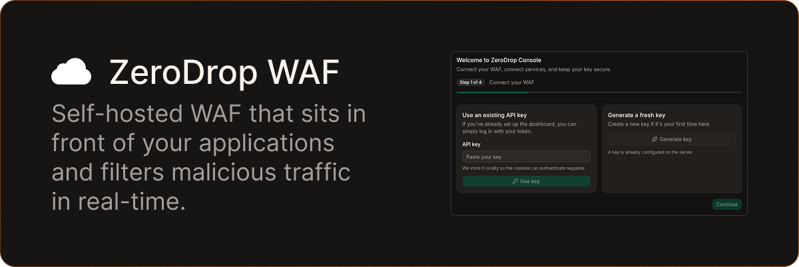
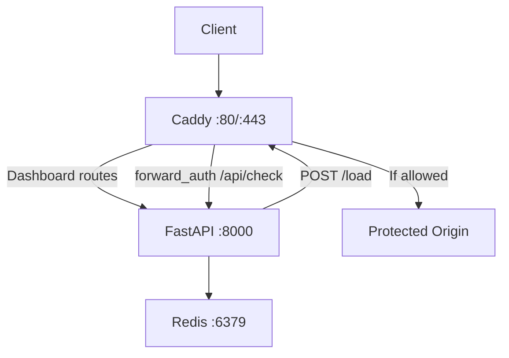
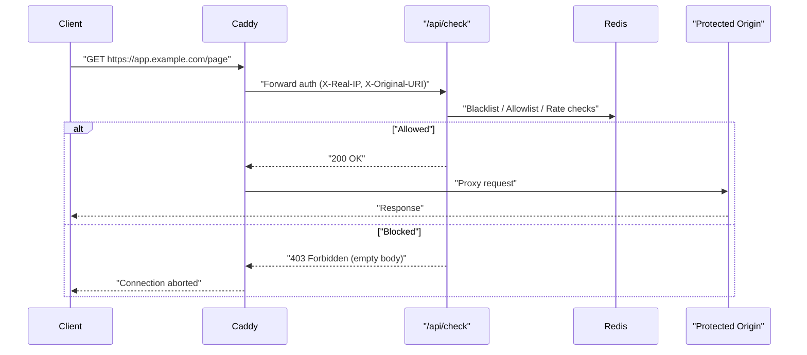

<div align="center">



# ZeroDrop

### your self-hosted web application firewall.

[](https://python.org/)
[](LICENSE)
[](https://github.com/feralbureau/zerodrop/stargazers)
[](https://github.com/feralbureau/zerodrop)

---

</div>

## What is ZeroDrop?

**ZeroDrop** is a self-hosted Web Application Firewall that sits in front of your applications and filters malicious traffic in real-time. It uses Caddy's `forward_auth` mechanism to intercept every incoming request, run it through a multi-layered security pipeline, and either allow it through or drop it silently.

Instead of configuring complex firewall rules by hand, ZeroDrop gives you a clean dashboard to manage blacklists, allowlists, denylists, rate limits, and uptime monitors — all backed by Redis for sub-millisecond decisions.

## Key Features

- **Multi-Layer Request Filtering**: Blacklist checks, allowlist bypasses, honeypot traps, bot detection, SQLi/XSS pattern matching, and header/query/body inspection — all in a single pipeline.
- **Adaptive Rate Limiting**: EWMA-based throttling that learns traffic patterns per IP, with spike detection for sudden bursts.
- **Real-Time Dashboard**: React SPA with live WebSocket feeds for blocked events and uptime status.
- **Uptime Monitoring**: Built-in HTTP and TCP health checks every 30 seconds with latency history and real-time broadcasts.
- **Anomaly Detection**: Per-domain RPM tracking with spike detection (rolling 5‑minute baseline, 3× threshold).
- **Dynamic Reverse Proxy**: Caddy configuration is generated and hot-reloaded on the fly — add or remove protected domains without restarts.
- **Country & User-Agent Blocking**: Deny traffic by geo-IP country code or user-agent string via simple denylist management.
- **One-Click Onboarding**: Guided setup flow that generates your API key, configures your first domain, and applies the Caddy config automatically.

## Tech Stack

<div>


</div>

## Installation

### Prerequisites

- [Docker](https://www.docker.com/get-started) & Docker Compose
- Git

### Environment Setup

Create a `.env` file in the root directory:

```env
# The hostname where the dashboard will be served
# If not provided, localhost is used
DASHBOARD_HOST=localhost
REDIS_URL=redis://localhost:6379/0
```

### Running with Docker

```bash
# Clone the repository
git clone https://github.com/feralbureau/zerodrop.git
cd zerodrop

# Set your dashboard host
echo "DASHBOARD_HOST=localhost" > .env

# Start all services
docker compose up --build
```

Open `http://localhost` to access the dashboard. The onboarding flow will guide you through initial setup.

### Running Locally (Development)

```bash
# Start Redis
redis-server

# Run the API server
uvicorn app.main:app --reload

# Run caddy
caddy run --config Caddyfile

# Build the dashboard
cd dashboard
npm install
npm run build

# After build, copy the dashboard bundle to the srv/ folder served by Caddy
cp -r dashboard/dist/* srv/
```

The dashboard server will be available at `dash.localhost` (or your configured host).

## Architecture

ZeroDrop consists of three containerized services orchestrated by Docker Compose. Caddy is the single entry point for all traffic — it serves the dashboard and enforces WAF protection on configured domains via `forward_auth`.



### Request Flow

When a request hits a protected domain, Caddy forwards it to `/api/check` before proxying to the origin:



### WAF Pipeline

Each request passes through these validation layers in order inside `check_ip()`:

1. **Allowlist** — Bypass all checks if IP or user-agent is whitelisted
2. **Denylist** — Block by user-agent string or country code
3. **Blacklist** — Immediate rejection if IP is already banned
4. **Honeypot** — Permanent ban on sensitive paths (`.env`, `/wp-admin`, `/.git`, etc.)
5. **Bot Detection** — Block known bot user-agent patterns (curl, wget, scrapy, etc.)
6. **Header Inspection** — Scan custom headers for SQLi/XSS payloads
7. **Query Inspection** — Scan URL parameters for malicious patterns
8. **Body Inspection** — Parse JSON or raw body for injection attempts
9. **Rate Limiting** — Adaptive EWMA-based throttling with spike detection

All decisions are logged to a Redis stream and broadcast to connected dashboard clients in real-time.

## WAF Rules & Toggles

Every security layer can be independently enabled or disabled from the dashboard:

| Rule | Key | Default | Description |
|------|-----|---------|-------------|
| Allowlist | `allowlist_enabled` | On | Bypass checks for trusted IPs/UAs |
| Honeypot | `honeypot_enabled` | On | Permaban on sensitive path access |
| Bot UA | `bot_ua_enabled` | On | Block known bot user-agents |
| Header Inspection | `header_inspection_enabled` | On | Scan headers for SQLi/XSS |
| Query Inspection | `query_inspection_enabled` | On | Scan URL params for payloads |
| Body Inspection | `body_inspection_enabled` | On | Scan request body for injections |
| Rate Limit | `rate_limit_enabled` | On | Fixed-window rate limiting (100 req/60s) |
| Adaptive Rate Limit | `adaptive_rate_limit_enabled` | On | EWMA-based dynamic thresholds |
| Spike Detection | `spike_rate_limit_enabled` | On | Immediate block on 3x burst |

## API Endpoints

### REST

| Method | Endpoint | Auth | Description |
|--------|----------|------|-------------|
| `POST` | `/api/setup` | No | Initial system setup (API key, domain, profile) |
| `GET/POST` | `/api/check` | API Key | WAF enforcement endpoint (called by Caddy) |
| `GET` | `/api/key/validate` | No | Check if system is configured |
| `POST` | `/api/key/regenerate` | API Key | Generate a new API key |
| `GET/PUT` | `/api/settings` | API Key | Read/update WAF settings and profile |
| `GET/POST/DELETE` | `/api/domains` | API Key | Manage protected domains |
| `GET` | `/api/logs` | API Key | Fetch WAF event log |
| `GET` | `/api/rpm` | API Key | RPM time series for a domain |
| `GET` | `/api/anomalies` | API Key | RPM anomaly events for a domain |
| `GET/POST` | `/api/blacklist` | API Key | List/add blacklisted IPs |
| `POST` | `/api/unban` | API Key | Remove an IP from the blacklist |
| `GET/POST` | `/api/allowlist` | API Key | List/add allowlist entries |
| `GET/POST` | `/api/denylist` | API Key | List/add denylist entries |
| `GET/POST/DELETE` | `/api/uptime` | API Key | Manage uptime monitors |
| `POST` | `/api/reset` | API Key | Flush all data and restart onboarding |

### WebSocket

| Endpoint | Description |
|----------|-------------|
| `/api/ws/logs` | Real-time stream of blocked events |
| `/api/ws/uptime` | Real-time uptime monitor updates |
| `/api/ws/ping` | Connectivity check (responds with `pong`) |

## Dashboard Pages

| Page | Path | Description |
|------|------|-------------|
| Dashboard | `/` | Charts and live security feed |
| Blacklist | `/blacklist` | Banned IPs and unban actions |
| Allowlist | `/allowlist` | Trusted sources and bypass rules |
| Domains | `/domains` | Protected sites and origins |
| Settings | `/settings` | WAF rules and enforcement toggles |

## Authentication

ZeroDrop uses **API key** authentication stored in Redis (`waf:api_key`). All protected endpoints require the key via:

- `X-API-Key` header, or
- `api_key` query parameter

WebSocket connections authenticate the same way. The API key is generated during onboarding and can be regenerated at any time from the dashboard.

## Redis Schema

| Key Pattern | Type | Purpose |
|-------------|------|---------|
| `waf:api_key` | String | System API key |
| `waf:settings` | Hash | WAF rule toggles |
| `waf:domains` | Hash | Domain → origin mappings |
| `profile:default` | String (JSON) | User nickname and avatar |
| `blacklist:{ip}` | String | Blocked IP (optional TTL) |
| `rate:{ip}` | String (counter) | Request count per window (60s TTL) |
| `ewma:{ip}` | String (float) | Adaptive rate threshold (24h TTL) |
| `allow:ip`, `allow:ua` | Set | Allowlist entries |
| `deny:ua`, `deny:country` | Set | Denylist entries |
| `waf_logs` | Stream | Ordered event log |
| `uptime:monitors` | Set | Monitor IDs |
| `uptime:monitor:{id}` | Hash | Monitor config and history |
| `rpm:count:{domain}:{minute}` | String | Raw per-minute counters (TTL) |
| `rpm:series:{domain}` | ZSet | RPM series (24h) |
| `rpm:anomalies:{domain}` | ZSet | RPM anomaly events (24h) |
| `rpm:first_seen:{domain}` | String | First traffic seen timestamp |

## License

Distributed under the MIT License. See `LICENSE` for more information.